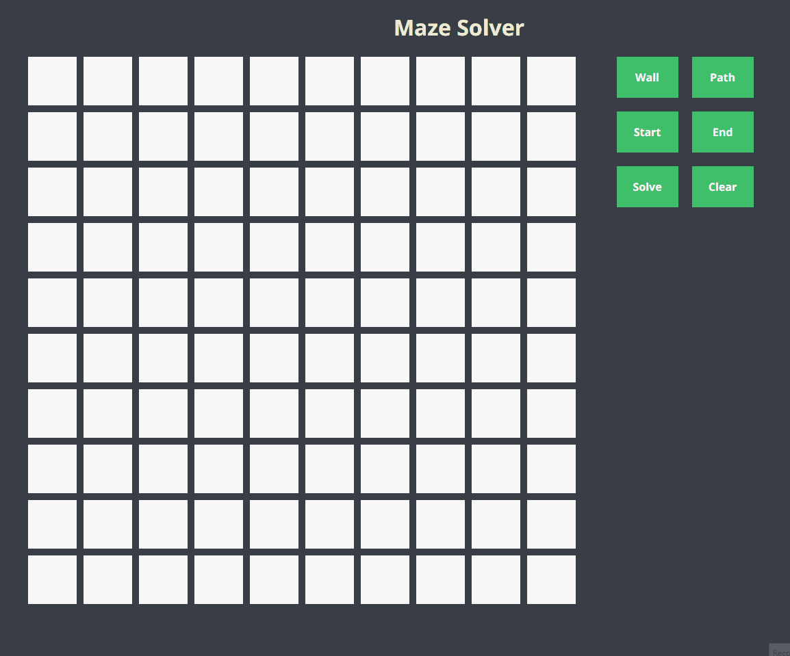

# Maze Solver

An application to draw simple mazes and find a path from a selected start to a selected end

## Run

You can run this application with `docker-compose up -d` or alternatively manually start both frontend and backend in their respective directories with `npm run dev` and `npm run start`

## Access

By deafult frontend runs on port `3000` and backend on port `5000`  
[Go to app](http://localhost:3000/)
